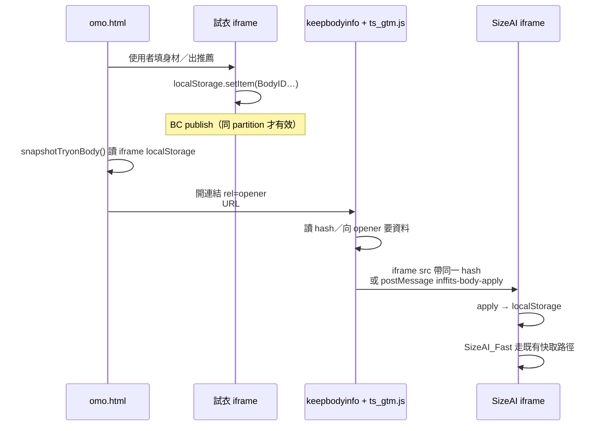

# 推薦尺寸跨頁同步實作指南

目標：使用者在 **OMO 試衣頁**（`personalizedpage-omo-demo.html`）填完身材、拿到推薦尺寸後，點商品進 **keepbodyinfo**，再開 SizeAI iframe 時**不必重填**，直接帶出同一組推薦。

涉及三份檔案：


| 檔案                                        | 角色                                       |
| ----------------------------------------- | ---------------------------------------- |
| `personalizedpage-omo-demo.html`（omo）     | 試衣頁；讀取試衣 iframe 的身材資料，帶去商品頁              |
| `ts_gtm.js`（gtm）                          | 掛在 keepbodyinfo；建立 SizeAI iframe，把身材注入進去 |
| `indexwebiframe_CAX_tw_mdmr.html`（iframe） | SizeAI 本體；寫入／讀取 `localStorage`，套用同步資料    |


---

## 先搞清楚：為什麼「只加 BroadcastChannel」不夠

```
試衣頁 parent:  liff-personal.vercel.app
  └─ iframe:     liff-personal.vercel.app/indexwebiframe_...   ← 第一方 storage

keepbodyinfo:    infshop.shoplineapp.com
  └─ iframe:     liff-personal.vercel.app/indexwebiframe_...   ← 第三方 storage（被隔離）
```

現代瀏覽器會做 **third-party storage partitioning**：

- 兩邊 iframe 雖然 URL 相同，但 `localStorage` **不共用**
- `BroadcastChannel` 也被 partition，**跨 top-level origin 收不到**

因此實際方案是 **三層**：

1. **iframe 內 BroadcastChannel** — 同 partition 內多個 tab／iframe 即時同步（加分）
2. **URL hash** `#inffits_body=` — 點商品時把 snapshot 帶過站（主力，不依賴 opener）
3. `rel="opener"` **+ postMessage** — keepbodyinfo 向試衣頁再要一次最新資料（備援）

同步的 key（身材／推薦相關）：

```js
'BodyID', 'BodyID_color', 'BodyID_size', 'BodyMID_size',
'Pattern_Prefers', 'SizeAIFast_switch', 'TID',
'BodyID0', 'BodyID1', 'BodyID2', 'BodyID3', 'BodyID4', 'BodyID5',
'CLOTHLIST', 'tb_cloth'ㄍ
```

Payload 編碼：`JSON → UTF-8 → base64url`（`+`→`-`，`/`→`_`，去掉 `=`）。

---


## 資料流（建議照這個理解）




---


## 1. 改 `indexwebiframe_CAX_tw_mdmr.html`（iframe）

在主邏輯腳本**之前**加一段 IIFE（本 repo 約在 `inf_main_CAXX.min.js` 前）。

### 必做

1. `apply(data)`
  把允許的 key 寫進 `localStorage`（設 `applying` flag，避免寫入時又觸發 publish 迴圈）。
2. **開機讀 hash**
  `location.hash` 有 `inffits_body=` 就 decode → `apply`。  
   必須在 SizeAI 初始化／讀 `BodyID` **之前**執行。
3. **聽 parent postMessage**
  ```js
   { MsgHeader: 'inffits-body-apply', data: { BodyID: '...', ... } }
  ```
   收到就 `apply`。
4. **BroadcastChannel**（同 origin、同 partition）
  - channel 名固定：`inffits-sizeai-body-sync`  
  - 開機 `request: true` 跟 peer 要資料  
  - hook `localStorage.setItem`：寫到同步 key 時 debounce publish  
  - 收到 SizeAI 相關 message（`SizeAI_Fast` / `FML_Done` / `bid` / `IDRxGet`）再 publish 一次


### 偽碼

```js
(function () {
  var CHANNEL = 'inffits-sizeai-body-sync';
  var KEYS = [ /* 見上方清單 */ ];
  var applying = false, bc = null;

  function apply(data) { /* KEYS 寫入 localStorage */ }
  function decodeBodyPayload(raw) { /* base64url → JSON */ }

  // A. hash
  var m = (location.hash || '').match(/inffits_body=([^&]*)/);
  if (m) apply(decodeBodyPayload(decodeURIComponent(m[1])));

  // B. parent postMessage
  window.addEventListener('message', function (e) {
    if (e.data && e.data.MsgHeader === 'inffits-body-apply') apply(e.data.data);
  });

  // C. BroadcastChannel
  if (typeof BroadcastChannel === 'undefined') return;
  bc = new BroadcastChannel(CHANNEL);
  bc.onmessage = function (ev) {
    if (ev.data.request) { /* publish snapshot */ return; }
    if (ev.data.data) apply(ev.data.data);
  };
  bc.postMessage({ type: 'inffits-body-sync', request: true });
  // hook setItem → schedulePublish
})();
```

---


## 2. 改 `personalizedpage-omo-demo.html`（omo）

前提：試衣 iframe 與 omo **同 origin**（例如都掛 `liff-personal.vercel.app`），parent 才能讀 `iframe.contentWindow.localStorage`。

### 必做

1. **兩端 iframe 同一個 base URL**
  ```js
   const MDMR_IFRAME_BASE = 'https://liff-personal.vercel.app/indexwebiframe_CAX_tw_mdmr.html'
  ```
2. **商品連結不要用** `rel="noopener"`
  改成 `rel="opener"` + `target="_blank"`，否則 keepbodyinfo 沒有 `window.opener`。
3. `snapshotTryonBody()`
  從 `#inffits_ctryon_window` 的 `localStorage` 撈同步 key；可順便 cache 到 `sessionStorage['inffits_body_sync']`。
4. **點商品時改寫 href**
  ```text
   https://infshop.shoplineapp.com/products/keepbodyinfo#inffits_body=<base64url>
  ```
  - 在 capture phase 點擊時再 snapshot 一次（拿到最新身材）  
  - **不要** `preventDefault` + `window.open`（會被擋彈窗）  
  - payload 太長（例如 > 3500）就只靠 opener，不塞 hash
5. **回應 opener 請求**
  ```js
   // 收到 { type: 'inffits-body-sync-request' }
   // 回覆 { type: 'inffits-body-sync-response', data: snapshot }
  ```
6. **動態商品卡**
  用 `MutationObserver` 把 `a.embeddedItem` 等 selector 的 `href` / `rel` 持續改成 keepbodyinfo + opener。


### 不要做

- 只設 `BroadcastChannel` 在 omo parent 層：parent 與 iframe 不同 context，且跨站後仍過不了 partition。  
- `rel="noopener noreferrer"`。

---


## 3. 改 `ts_gtm.js`（gtm / keepbodyinfo）


### 必做

1. **iframe 指到與 omo 相同的 HTML**
  ```js
   IFRAME_SRC_BASE = "https://liff-personal.vercel.app/indexwebiframe_CAX_tw_mdmr.html"
  ```
2. **開機拿身材**
  - `PENDING_BODY_SYNC = readBodyFromLocation()`（讀 `#inffits_body=` 或 query）  
  - 若有 `window.opener`：  
  `postMessage({ type: 'inffits-body-sync-request' }, 'https://liff-personal.vercel.app')`  
  並聽 `inffits-body-sync-response`
3. **建立 iframe 時把 payload 帶進 src**
  ```js
   src = IFRAME_SRC_BASE + '?' + Gender_ClothID + '&_v=cdn2' + bodySyncHashSuffix()
   // bodySyncHashSuffix() → "#inffits_body=..." 或 ""
  ```
4. `pushBodyToIframe()`
  ```js
   iframe.contentWindow.postMessage({
     MsgHeader: 'inffits-body-apply',
     data: PENDING_BODY_SYNC
   }, '*')
  ```
   時機：
  - iframe `load`
  - 延遲 retry（例如 500ms / 1500ms，避免腳本還沒掛上 listener）
  - 使用者點「AI 找尺寸」／SizeAItag **之前**再推一次
5. **origin allowlist**
  若有 `postMessage` origin 檢查，把 vercel iframe hostname 加進去。

---


## 驗收清單

1. 開 omo（硬重新整理）→ 試衣 iframe 完成身材到出尺寸。
2. 點商品：新分頁 URL 應含 `#inffits_body=`，且連結 `rel` 為 `opener`。
3. keepbodyinfo 載入的是 **vercel 的** `ts_gtm.js` **+ 同一個 iframe HTML**。
4. 開「AI 找尺寸」：iframe Application → Local Storage 應已有 `BodyID`／`BodyID_size`，並走快取／Fast 路徑，不需重填。
5. （可選）同瀏覽器再開一個同 origin 試衣 iframe：BC 應能即時互相同步。


### Console 快速查

在 **SizeAI iframe** context：

```js
localStorage.getItem('BodyID')
localStorage.getItem('BodyID_size')
```

在 keepbodyinfo parent：

```js
location.hash.includes('inffits_body')
!!window.opener
```

---


## 常見失敗原因


| 現象                 | 原因                                                            |
| ------------------ | ------------------------------------------------------------- |
| 兩邊都填過但互不認得         | iframe 不同 origin（一邊 vercel、一邊 inffits.com）或 storage partition |
| 有 hash 仍要重填        | iframe 腳本太晚才 apply，或 SizeAI 已在 apply 前讀完 empty BodyID         |
| 點了沒開分頁             | 用了 `preventDefault` + `window.open` 被擋                        |
| opener 要不到資料       | 連結仍是 `noopener`，或試衣頁已關                                        |
| keepbodyinfo 完全沒注入 | 線上 GTM 還在打舊的 `ts_gtm.js`                                      |


---


## 最小改動對照


| 檔案              | 最小必要改動                                                                        |
| --------------- | ----------------------------------------------------------------------------- |
| **iframe html** | hash apply + `inffits-body-apply` +（建議）BC publish/subscribe                   |
| **omo.html**    | 同 origin iframe、`rel=opener`、點擊帶 `#inffits_body=`、回應 sync-request             |
| **ts_gtm.js**   | 同 iframe URL、讀 hash/opener、src 帶 hash、`pushBodyToIframe` 在 load／開啟 SizeAI 時呼叫 |


**結論：** BroadcastChannel 適合「同 origin、同 storage partition」的即時同步；  
**跨試衣頁 → keepbodyinfo** 必須再加上 **hash 攜帶** 與 `rel="opener"` **postMessage**，推薦尺寸才會真正跟過去。